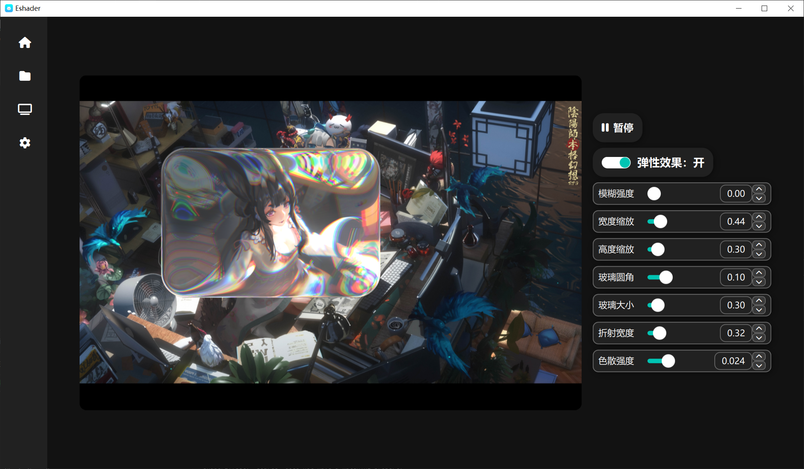
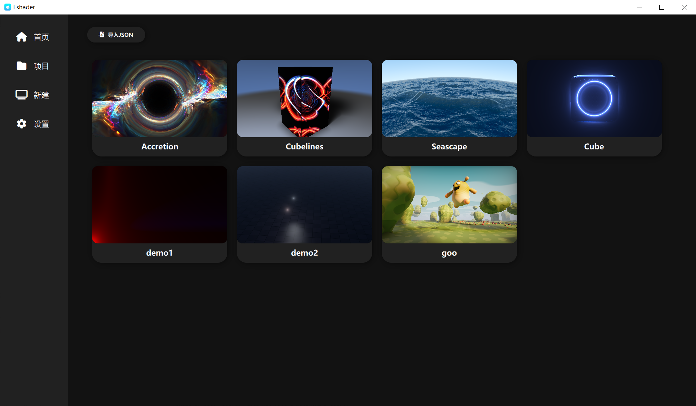
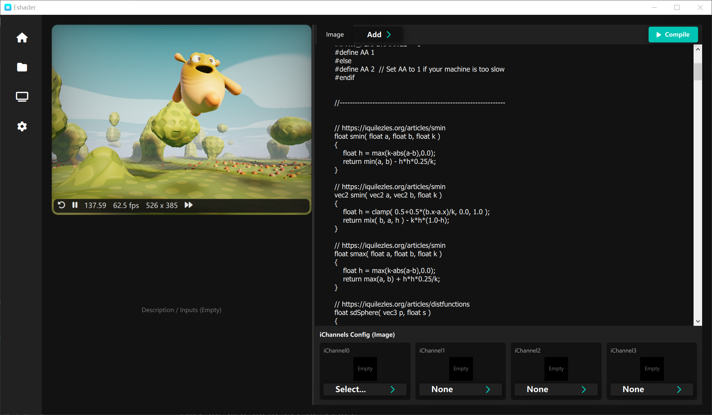

# Eshader

一个基于 Qt 6（Qt Quick/QML）的实时 Shader 实验台：支持类似 Shadertoy 的多 Buffer 管线（Common + Buffer A~D + Image）、通道贴图选择、预设浏览与导入，并包含一组可复用的 QML 组件（EvolveUI）。

## 预览

| 首页（Liquid Glass） | 预设/项目 | Shader 编辑与运行 |
| --- | --- | --- |
|  |  |  |

## 功能

- 实时编译与运行片元 Shader（运行时通过 `qsb` 编译为 `.qsb`）
- 多通道输入：`iChannel0~3` 支持选择本地纹理文件或其它 Buffer 输出
- 多 Pass：Common + Buffer A/B/C/D + Image（Buffer 链式输出，Image 默认接最后一个激活的 Buffer）
- 预设浏览：从 `presets/` 自动扫描并生成缩略预览
- 预设导入：支持导入配置 JSON 直接加载工作区
- 自定义 UI 组件库：`components/` 下的 EvolveUI 组件与效果（例如 Liquid Glass）

## 构建与运行

### 依赖

- CMake ≥ 3.16
- Qt ≥ 6.8（需要组件：Quick、Multimedia、Network、ShaderTools）
- C++ 编译器（Windows 推荐 MSVC）

### Windows（示例）

```bash
cmake -S . -B build -DCMAKE_PREFIX_PATH="C:/Qt/6.8.0/msvc2022_64"
cmake --build build --config Release
```

运行：

- `build/Release/Eshader.exe`

## 资源目录约定（Textures / Presets）

程序会尝试在以下位置寻找 `textures/`（优先级从上到下），并用于纹理下拉列表：

1. 当前工作目录下的 `./textures`
2. 可执行文件同目录下的 `./textures`
3. 源码目录下的 `./textures`

`presets/` 默认与 `textures/` 同级（即 `textures/` 的兄弟目录）。为了让预设与纹理正常可用，推荐：

- 从仓库根目录启动程序，或
- 将 `textures/`、`presets/` 复制到发布目录（与 exe 同级）

## 打包（Windows）

仓库提供了 `package.bat`，会将可执行文件复制到 `output/`，并调用 `windeployqt` 收集依赖：

```bat
package.bat Release
```

## 目录结构

```text
.
├─components/        自定义 QML 组件（EvolveUI）
├─pages/             主页面（首页/项目/Shader/设置）
├─presets/           预设（每个目录包含 config.json 与 .frag 等资源）
├─textures/          纹理资源（可作为 iChannel 输入）
├─preview/           README 展示图
├─main.cpp           应用入口（注册 ShaderCompiler）
├─ShaderCompiler.*   运行时调用 qsb 编译 Shader
└─CMakeLists.txt     CMake + Qt QML Module 配置
```

## 许可证

MIT License，详见 [LICENSE](LICENSE)。
